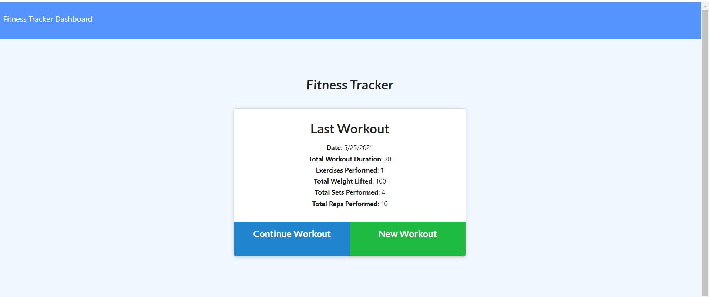
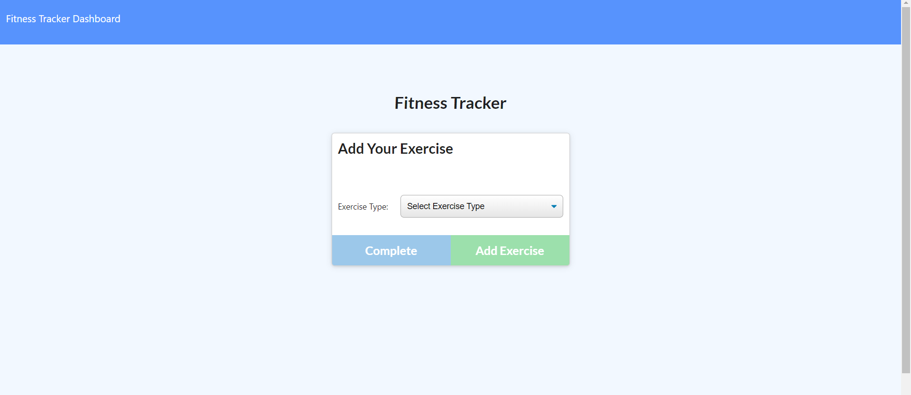

# Fitness Tracker

## Jennifer Detmering

## Description-

### Tracks your daily workouts and progress

#### []

## Table of Contents

1. [Installation](#installation)
2. [Usage](#usage)
3. [Technologies Used](#technologies_used)
4. [Credits](#credits)
5. [License](#license)
6. [Features](#features)
7. [Questions and Contributions](#questions_and_contributions)
8. [Tests](#tests)

## Installation-

## Usage-

## Technologies Used-

npm, JavaScript , node.js, mongodb, mongoose, express

## Credits-

### mozilla developer docs https://developer.mozilla.org/en-US/docs/Learn

### stack overflow https://stackoverflow.com

## License-

### License: MIT https://opensource.org/licenses/MIT

## Features-

Adds and updates your workout to see your progress

## Questions and Contributions-

### GitHub Profile: https://github.com/kodiakshuksan

### Email: kodiakshuksan@yahoo.com

## Tests-

none
